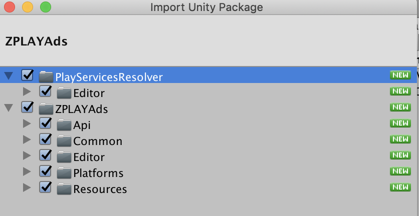
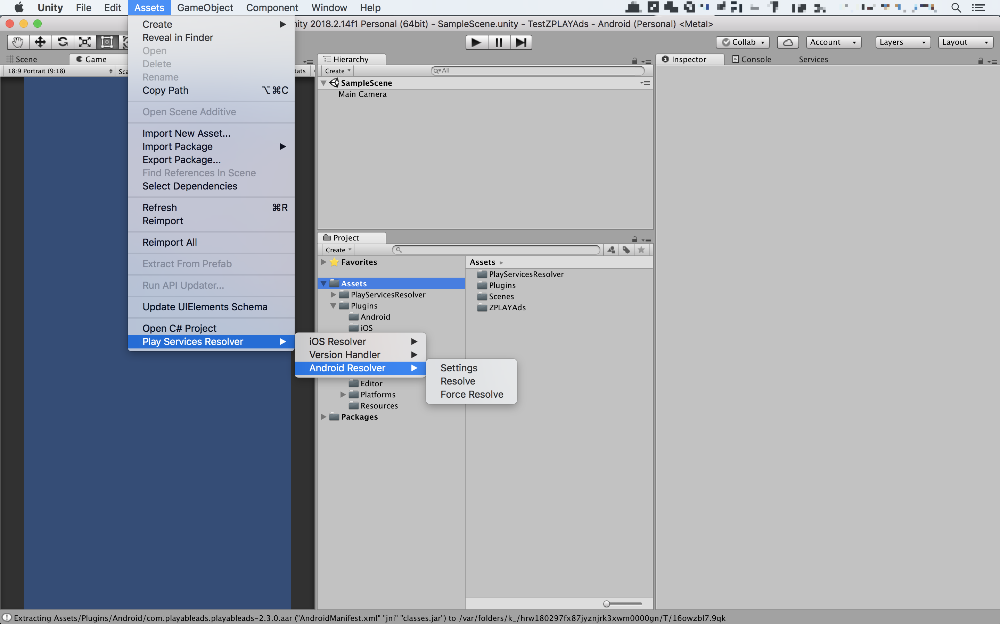

- [ZPLAYAds for Unity](#zplayads-for-unity)
  - [Get Started](#get-started)
  - [Download the ZPLAYAds Unity plugin](#download-the-zplayads-unity-plugin)
  - [Import the Mobile Ads Unity plugin](#import-the-mobile-ads-unity-plugin)
  - [Include the ZPLAYAds SDK](#include-the-zplayads-sdk)
    - [Deploy to iOS](#deploy-to-ios)
    - [Deploy to Android](#deploy-to-android)
  - [Select an Ad Format](#select-an-ad-format)
    - [Interstitial](#interstitial)
      - [Initialize and Request Interstitial](#initialize-and-request-interstitial)
      - [Request Interstitial](#request-interstitial)
      - [Judge Whether Interstitial Has Been Loaded](#judge-whether-interstitial-has-been-loaded)
      - [Present Interstitial](#present-interstitial)
    - [Rewarded Video](#rewarded-video)
      - [Initialize and Request Rewarded Video](#initialize-and-request-rewarded-video)
      - [Request Rewarded Video](#request-rewarded-video)
      - [Judge Whether Rewarded Video Has Been Loaded](#judge-whether-rewarded-video-has-been-loaded)
      - [Present Rewarded Video](#present-rewarded-video)

# ZPLAYAds for Unity

## Get Started

1.Guide Intended for

This guide is intended for publishers who want to integrate ZPLAYAds SDK to theri Unity apps. 

2.Prerequisites

- Use Unity 5.6 or higher
- To deploy to iOS

   Xcode 7.0 or higher

   iOS 8.0 or higher

   [CocoaPods](https://guides.cocoapods.org/using/getting-started.html)

- To deploy Android

  Target Android API level 14 or higher

3.[Access Demo](../../Assets)   

## Download the ZPLAYAds Unity plugin

The ZPLAYAds Unity plugin enables Unity developers to easily serve ZPLAY Ads on Android and iOS apps without having to write Java or Objective-C code. The plugin provides a C# interface for requesting ads that is used by C# scripts in your Unity project. You can download the [ZPLAYAds Unity plugin](../ZPLAYAds.unitypackage) or look at its code on GitHub.([codes of Android](../android-library/app/src/main/java/com/zplay/adsunity)、[codes of iOS](../../Assets/Plugins/iOS)、[view source](../../Assets/ZPLAYAds))

## Import the Mobile Ads Unity plugin

Open your project in the Unity editor. Select **Assets> Import Package> Custom Package** and find the ZPLAYAds.unitypackage file you downloaded.


Make sure all of the files are selected and click **Import**.



## Include the ZPLAYAds SDK

The ZPLAYAds Unity plugin is distributed with the [Unity Play Services Resolver library](https://github.com/googlesamples/unity-jar-resolver). This library is intended for use by any Unity plugin that requires access to Android specific libraries (e.g., AARs) or iOS CocoaPods. It provides Unity plugins the ability to declare dependencies, which are then automatically resolved and copied into your Unity project.

Follow the steps listed below to ensure your project includes the ZPLAYAds SDK.

### Deploy to iOS

No additional steps are required to include the ZPLAYAds SDK into the Unity project.

After building, open **xcworkspace** project. 

**Note: iOS dependencies are identified using CocoaPods. CocoaPods is run as a post build process step.**

### Deploy to Android

In the Unity editor, select **Assets> Play Services Resolver> Android Resolver>Force Resolve**. The Unity Play Services Resolver library will copy the declared dependencies into the **Assets/Plugins/Android** directory of your Unity app.



Note: The Google Mobile Ads Unity plugin dependencies are listed in **Assets/ZPLAYAds/Editor/ZPLAYAdsDependencies.xml**

## Select an Ad Format

The ZPLAYAds SDK is now included in your Unity app when deploying to either the Android or iOS platform. You're now ready to implement an ad. ZPLAYAds offers a number of different ad formats, so you can choose the one that best fits your user experience needs.

### Interstitial

#### Initialize and Request Interstitial

```C#
using ZPLAYAds.Api;
using ZPLAYAds.Common;
public class ZPLAYAdsDemoScript : MonoBehaviour
{
  #if UNITY_ANDROID
   const string ZPLAYADS_APP_ID = "YOUR_ZPLAYAds_APP_ID_ANDROID";
   const string ZPLAYADS_UNIT_ID_INTERSTITIAL = "YOUR_ZPLAYAds_UNIT_ID_INTERSTITIAL_ANDROID";
  #elif UNITY_IOS
   const string ZPLAYADS_APP_ID = "YOUR_ZPLAYAds_APP_ID_IOS";
   const string ZPLAYADS_UNIT_ID_INTERSTITIAL = "YOUR_ZPLAYAds_UNIT_ID_INTERSTITIAL_IOS";
  #else
   const string ZPLAYADS_APP_ID = "unexpected_platform";
   const string ZPLAYADS_UNIT_ID_INTERSTITIAL = "unexpected_platform";
  #endif

  InterstitialAd interstitial;

  void Start() 
  {
    interstitial = new InterstitialAd(ZPLAYADS_APP_ID, ZPLAYADS_UNIT_ID_INTERSTITIAL);
    interstitial.SetAutoloadNext(true);
    interstitial.OnAdLoaded += HandleInterstitialLoaded;
    interstitial.OnAdFailed += HandleInterstitialFailed;
    interstitial.OnAdStarted += HandleInterstitialStart;
    interstitial.OnAdVideoCompleted += HandleInterstitialVideoCompleted;
    interstitial.OnAdClicked += HandleInterstitialClicked;
    interstitial.OnAdCompleted += HandleInterstitialCompleted;
  }
  
  #region Interstitial callback handlers
  public void HandleInterstitialLoaded(object sender, EventArgs args)
  {
    print("===> HandleInterstitialLoaded event received");
  }
  public void HandleInterstitialFailed(object sender, AdFailedEventArgs args)
  {
    print("===> HandleInterstitialFailed event received with message: " + args.Message);
  }
  public void HandleInterstitialStart(object sender, EventArgs args)
  {
    print("===> HandleInterstitialStart event received.");
  }
  public void HandleInterstitialVideoCompleted(object sender, EventArgs args)
  {
    print("===> HandleInterstitialVideoCompleted event received.");
  }
  public void HandleInterstitialClicked(object sender, EventArgs args)
  {
    print("===> HandleInterstitialClicked event received.");
  }
  public void HandleInterstitialCompleted(object sender, EventArgs args)
  {
    print("===> HandleInterstitialClosed event received.");
  }
  #endregion
}
```

#### Request Interstitial

If you open autoload ```interstitial.SetAutoloadNext(true)``` mode, after first request, the SDK will request the next ad automatically when an ad has been completed or request failure. 

```C#
interstitial.LoadAd(ZPLAYADS_UNIT_ID_INTERSTITIAL);
```

#### Judge Whether Interstitial Has Been Loaded

```c#
interstitial.IsLoaded(ZPLAYADS_UNIT_ID_INTERSTITIAL)
```

#### Present Interstitial

We suggest you call ```interstitial.IsLoaded(ZPLAYADS_UNIT_ID_INTERSTITIAL)``` first to judge whether Interstitial has been loaded

```C#
if(interstitial.IsLoaded(ZPLAYADS_UNIT_ID_INTERSTITIAL))
{
  interstitial.Show(ZPLAYADS_UNIT_ID_INTERSTITIAL);
}
```

### Rewarded Video

#### Initialize and Request Rewarded Video

```C#
using ZPLAYAds.Api;
using ZPLAYAds.Common;
public class ZPLAYAdsDemoScript : MonoBehaviour
{
  #if UNITY_ANDROID
   const string ZPLAYADS_APP_ID = "YOUR_ZPLAYAds_APP_ID_ANDROID";
   const string ZPLAYADS_UNIT_ID_REWARD_VIDEO = "YOUR_ZPLAYAds_UNIT_ID_REWARD_VIDEO_ANDROID";
  #elif UNITY_IOS
   const string ZPLAYADS_APP_ID = "YOUR_ZPLAYAds_APP_ID_IOS";
   const string ZPLAYADS_UNIT_ID_REWARD_VIDEO = "YOUR_ZPLAYAds_UNIT_ID_REWARD_VIDEO_IOS";
  #else
   const string ZPLAYADS_APP_ID = "unexpected_platform";
   const string ZPLAYADS_UNIT_ID_REWARD_VIDEO = "unexpected_platform";
  #endif

  RewardVideoAd rewardVideo;

  void Start() 
  {
    rewardVideo = new RewardVideoAd(ZPLAYADS_APP_ID, ZPLAYADS_UNIT_ID_REWARD_VIDEO);
    rewardVideo.SetAutoloadNext(true);
    rewardVideo.OnAdLoaded += HandleRewardVideoLoaded;
    rewardVideo.OnAdFailed += HandleRewardVideoFailed;
    rewardVideo.OnAdStarted += HandleRewardVideoStart;
    rewardVideo.OnAdVideoCompleted += HandleRewardVideoVideoCompleted;
    rewardVideo.OnAdClicked += HandleRewardVideoClicked;
    rewardVideo.OnAdRewarded += HandleRewardVideoRewarded;
    rewardVideo.OnAdCompleted += HandleRewardVideoCompleted;
  }

  #region RewardVideo callback handlers
  public void HandleRewardVideoLoaded(object sender, EventArgs args)
  {
      print("===> HandleRewardVideoLoaded event received");
  }
  public void HandleRewardVideoFailed(object sender, AdFailedEventArgs args)
  {
      print("===> HandleRewardVideoFailed event received with message: " + args.Message);
  }
  public void HandleRewardVideoStart(object sender, EventArgs args)
  {
      print("===> HandleRewardVideoStart event received.");
  }
  public void HandleRewardVideoVideoCompleted(object sender, EventArgs args)
  {
      print("===> HandleRewardVideoVideoCompleted event received.");
  }
  public void HandleRewardVideoClicked(object sender, EventArgs args)
  {
      print("===> HandleRewardVideoClicked event received.");
  }
  public void HandleRewardVideoRewarded(object sender, EventArgs args)
  {
      print("===> HandleRewardVideoRewarded event received.");
  }
  public void HandleRewardVideoCompleted(object sender, EventArgs args)
  {
      print("===> HandleRewardVideoCompleted event received.");
  }
  #endregion
}
```

#### Request Rewarded Video
If you open autoload ```interstitial.SetAutoloadNext(true)``` mode, after first request, the SDK will request the next ad automatically when an ad has been completed or request failure. 

```C#
rewardVideo.LoadAd(ZPLAYADS_UNIT_ID_REWARD_VIDEO);
```

#### Judge Whether Rewarded Video Has Been Loaded

```c#
rewardVideo.IsLoaded(ZPLAYADS_UNIT_ID_REWARD_VIDEO)
```

#### Present Rewarded Video

```c#
if(rewardVideo.IsLoaded(ZPLAYADS_UNIT_ID_REWARD_VIDEO))
{
  rewardVideo.Show(ZPLAYADS_UNIT_ID_REWARD_VIDEO);
} 
```
