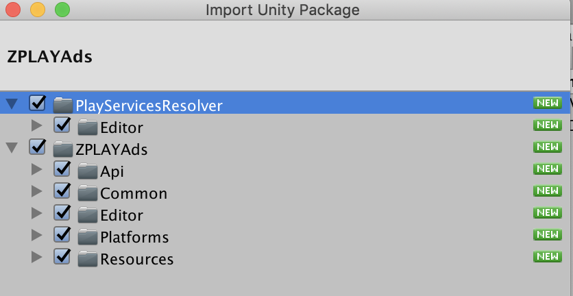

- [ZPLAYAds for Unity](#zplayads-for-unity)
  - [概述](#%e6%a6%82%e8%bf%b0)
  - [下载ZPLAYAds Unity插件](#%e4%b8%8b%e8%bd%bdzplayads-unity%e6%8f%92%e4%bb%b6)
  - [导入ZPLAYAds Unity插件](#%e5%af%bc%e5%85%a5zplayads-unity%e6%8f%92%e4%bb%b6)
  - [集成ZPLAYAds](#%e9%9b%86%e6%88%90zplayads)
    - [部署iOS项目](#%e9%83%a8%e7%bd%b2ios%e9%a1%b9%e7%9b%ae)
    - [部署Android项目](#%e9%83%a8%e7%bd%b2android%e9%a1%b9%e7%9b%ae)
  - [选择广告形式](#%e9%80%89%e6%8b%a9%e5%b9%bf%e5%91%8a%e5%bd%a2%e5%bc%8f)
    - [Interstitial](#interstitial)
      - [初始化及请求插屏](#%e5%88%9d%e5%a7%8b%e5%8c%96%e5%8f%8a%e8%af%b7%e6%b1%82%e6%8f%92%e5%b1%8f)
      - [请求Interstitial](#%e8%af%b7%e6%b1%82interstitial)
      - [判断Interstitial是否准备好](#%e5%88%a4%e6%96%adinterstitial%e6%98%af%e5%90%a6%e5%87%86%e5%a4%87%e5%a5%bd)
      - [展示Interstitial](#%e5%b1%95%e7%a4%bainterstitial)
    - [Rewarded Video](#rewarded-video)
      - [初始化及请求视频](#%e5%88%9d%e5%a7%8b%e5%8c%96%e5%8f%8a%e8%af%b7%e6%b1%82%e8%a7%86%e9%a2%91)
      - [请求Rewarded Video](#%e8%af%b7%e6%b1%82rewarded-video)
      - [判断Rewarded Video是否准备好](#%e5%88%a4%e6%96%adrewarded-video%e6%98%af%e5%90%a6%e5%87%86%e5%a4%87%e5%a5%bd)
      - [展示Rewarded Video](#%e5%b1%95%e7%a4%barewarded-video)
    - [Banner](#banner)
      - [初始化 Banner](#%e5%88%9d%e5%a7%8b%e5%8c%96-banner)
      - [请求 Banner](#%e8%af%b7%e6%b1%82-banner)
      - [隐藏 Banner](#%e9%9a%90%e8%97%8f-banner)
      - [展示 Banner](#%e5%b1%95%e7%a4%ba-banner)
      - [销毁 Banner](#%e9%94%80%e6%af%81-banner)
  - [测试](#%e6%b5%8b%e8%af%95)

  - [测试](#%E6%B5%8B%E8%AF%95)

# ZPLAYAds for Unity

## 概述

1.面向人群

本产品主要面向需要在 Unity 产品中接 ZPLAYAds SDK 的开发人员。

2.先决条件

- Unity 5.6 或更高版本


- 部署 iOS

   Xcode 7.0 或更高版本

   iOS 8.0 或更高版本

   [CocoaPods](https://guides.cocoapods.org/using/getting-started.html)

- 部署 Android

  Android API 14 或更高版本

3.[Demo 获取地址](../../Assets)   

## 下载ZPLAYAds Unity插件

ZPLAYAds Unity插件使Unity开发人员可以轻松地在 Android 和 iOS 应用上展示广告，无需编写 Java 或 Objective-C 代码。该插件提供了一个 C# 接口来请求广告。您可以[下载ZPLAYAds Unity插件包](https://github.com/zplayads/ZPLAYAds-unity/raw/master/source/ZPLAYAds.unitypackage)或在GitHub上查看代码。（[Android代码](../android-library/app/src/main/java/com/zplay/adsunity)、[iOS代码](../../Assets/Plugins/iOS)、[查看源码](../../Assets/ZPLAYAds)）

## 导入ZPLAYAds Unity插件

在 Unity 编辑器中打开您的项目。选择 **Assets> Import Package> Custom Package**，找到您下载的 ZPLAYAds.unitypackage 文件。


确保选中所有文件，然后单击 **Import**.



## 集成ZPLAYAds

ZPLAYAds Unity插件与[Unity Play Services Resolver library](https://github.com/googlesamples/unity-jar-resolver)一起发布。这个Library适用于任何需要访问Android特定库(例如AARs)或iOS CocoaPods的Unity插件。它声明了Unity插件的依赖项，这些依赖项可被自动解析并复制到Unity项目中。

请按照下面列出的步骤操作以确保集成ZPLAYAds Unity插件。

### 部署iOS项目

将ZPLAYAds集成到Unity项目中无需其他步骤。

构建完成，打开**xcworkspace**工程。

**注意：使用CocoaPods识别iOS依赖项。CocoaPods作为后期构建过程步骤运行。**

### 部署Android项目

在Unity编辑器中，选择 **Assets> Play Services Resolver> Android Resolver>Force Resolve**。 Unity Play 服务解析器库会将声明的依赖项复制到Unity应用程序的**Assets/Plugins/Android**目录中。


注意：ZPLAYAds Unity插件依赖项列在 **Assets/ZPLAYAds/Editor/ZPLAYAdsDependencies.xml**中

## 选择广告形式

现在，您的Unity应用已经成功接入了ZPLAYAds SDK，之后便可展示广告了。ZPLAYAds提供不同的广告形式，您可以选择最符合您用户体验要求的广告形式。

### Interstitial

#### 初始化及请求插屏

```C#
using ZPLAYAds.Api;
using ZPLAYAds.Common;
public class ZPLAYAdsDemoScript : MonoBehaviour
{
#if UNITY_ANDROID
  const string ZPLAYADS_APP_ID = "YOUR_ZPLAYAds_APP_ID_ANDROID";
  const string ZPLAYADS_UNIT_ID_INTERSTITIAL = "YOUR_ZPLAYAds_UNIT_ID_INTERSTITIAL_ANDROID";
#elif UNITY_IOS
  const string ZPLAYADS_APP_ID = "YOUR_ZPLAYAds_APP_ID_IOS";
  const string ZPLAYADS_UNIT_ID_INTERSTITIAL = "YOUR_ZPLAYAds_UNIT_ID_INTERSTITIAL_IOS";
#else
  const string ZPLAYADS_APP_ID = "unexpected_platform";
  const string ZPLAYADS_UNIT_ID_INTERSTITIAL = "unexpected_platform";
#endif

  InterstitialAd interstitial;

  void Start() 
  {
    AdOptions adOptions = new AdOptionsBuilder()
      .SetChannelId("")
      .SetAutoLoadNext(true)
      .build();

    interstitial = new InterstitialAd(ZPLAYADS_APP_ID, ZPLAYADS_UNIT_ID_INTERSTITIAL, adOptions);
    interstitial.OnAdLoaded += HandleInterstitialLoaded;
    interstitial.OnAdFailedToLoad += HandleInterstitialFailedToLoad;
    interstitial.OnAdStarted += HandleInterstitialStart;
    interstitial.OnAdClicked += HandleInterstitialClicked;
    interstitial.OnAdClosed += HandleInterstitialClosed;
  }

  #region Interstitial callback handlers
  public void HandleInterstitialLoaded(object sender, EventArgs args)
  {
    print("===> HandleInterstitialLoaded event received");
  }
  public void HandleInterstitialFailedToLoad(object sender, AdFailedEventArgs args)
  {
    print("===> HandleInterstitialFailedToLoad event received with message: " + args.Message);
  }
  public void HandleInterstitialStart(object sender, EventArgs args)
  {
    print("===> HandleInterstitialStart event received.");
  }
  public void HandleInterstitialClicked(object sender, EventArgs args)
  {
    print("===> HandleInterstitialClicked event received.");
  }
  public void HandleInterstitialClosed(object sender, EventArgs args)
  {
    print("===> HandleInterstitialClosed event received.");
  }
  #endregion
}
```

#### 请求Interstitial

如果打开自动请求模式，首次请求后，SDK 会在展示完成后或广告请求失败后自动请求下一条广告

```C#
interstitial.LoadAd(ZPLAYADS_UNIT_ID_INTERSTITIAL);
```

#### 判断Interstitial是否准备好

```c#
interstitial.IsReady(ZPLAYADS_UNIT_ID_INTERSTITIAL)
```

#### 展示Interstitial

建议先调用 ```interstitial.IsReady(ZPLAYADS_UNIT_ID_INTERSTITIAL)``` 判断插屏是否准备好

```C#
if(interstitial.IsReady(ZPLAYADS_UNIT_ID_INTERSTITIAL))
{
  interstitial.Show(ZPLAYADS_UNIT_ID_INTERSTITIAL);
}
```

### Rewarded Video

#### 初始化及请求视频

```C#
using ZPLAYAds.Api;
using ZPLAYAds.Common;
public class ZPLAYAdsDemoScript : MonoBehaviour
{
#if UNITY_ANDROID
  const string ZPLAYADS_APP_ID = "YOUR_ZPLAYAds_APP_ID_ANDROID";
  const string ZPLAYADS_UNIT_ID_REWARD_VIDEO = "YOUR_ZPLAYAds_UNIT_ID_REWARD_VIDEO_ANDROID";
#elif UNITY_IOS
  const string ZPLAYADS_APP_ID = "YOUR_ZPLAYAds_APP_ID_IOS";
  const string ZPLAYADS_UNIT_ID_REWARD_VIDEO = "YOUR_ZPLAYAds_UNIT_ID_REWARD_VIDEO_IOS";
#else
  const string ZPLAYADS_APP_ID = "unexpected_platform";
  const string ZPLAYADS_UNIT_ID_REWARD_VIDEO = "unexpected_platform";
#endif

  RewardVideoAd rewardVideo;

  void Start() 
  {
    AdOptions adOptions = new AdOptionsBuilder()
      .SetChannelId("")
      .SetAutoLoadNext(true)
      .build();

    rewardVideo = new RewardVideoAd(ZPLAYADS_APP_ID, ZPLAYADS_UNIT_ID_REWARD_VIDEO, adOptions);
    rewardVideo.OnAdLoaded += HandleRewardVideoLoaded;
    rewardVideo.OnAdFailedToLoad += HandleRewardVideoFailedToLoad;
    rewardVideo.OnAdStarted += HandleRewardVideoStart;
    rewardVideo.OnAdClicked += HandleRewardVideoClicked;
    rewardVideo.OnAdRewarded += HandleRewardVideoRewarded;
    rewardVideo.OnAdClosed += HandleRewardVideoClosed;
  }

  #region RewardVideo callback handlers
  public void HandleRewardVideoLoaded(object sender, EventArgs args)
  {
    print("===> HandleRewardVideoLoaded event received");
  }
  public void HandleRewardVideoFailedToLoad(object sender, AdFailedEventArgs args)
  {
    print("===> HandleRewardVideoFailedToLoad event received with message: " + args.Message);
  }
  public void HandleRewardVideoStart(object sender, EventArgs args)
  {
    print("===> HandleRewardVideoStart event received.");
  }
  public void HandleRewardVideoClicked(object sender, EventArgs args)
  {
    print("===> HandleRewardVideoClicked event received.");
  }
  public void HandleRewardVideoRewarded(object sender, EventArgs args)
  {
    print("===> HandleRewardVideoRewarded event received.");
  }
  public void HandleRewardVideoClosed(object sender, EventArgs args)
  {
    print("===> HandleRewardVideoClosed event received.");
  }
  #endregion
}
```

#### 请求Rewarded Video
如果开启自动请求模式，首次请求后，SDK会在展示完成后或广告请求失败后自动请求下一条广告

```C#
rewardVideo.LoadAd(ZPLAYADS_UNIT_ID_REWARD_VIDEO);
```

#### 判断Rewarded Video是否准备好

```c#
rewardVideo.IsReady(ZPLAYADS_UNIT_ID_REWARD_VIDEO)
```

#### 展示Rewarded Video

```c#
if(rewardVideo.IsReady(ZPLAYADS_UNIT_ID_REWARD_VIDEO))
{
  rewardVideo.Show(ZPLAYADS_UNIT_ID_REWARD_VIDEO);
} 
```
### Banner
#### 初始化 Banner
```C#
using ZPLAYAds.Api;
using ZPLAYAds.Common;
public class ZPLAYAdsDemoScript : MonoBehaviour
{
#if UNITY_ANDROID
  const string ZPLAYADS_APP_ID = "YOUR_ZPLAYAds_APP_ID_ANDROID";
  const string ZPLAYADS_UNIT_ID_BANNER = "YOUR_ZPLAYAds_UNIT_ID_BANNER_ANDROID";
#elif UNITY_IOS
  const string ZPLAYADS_APP_ID = "YOUR_ZPLAYAds_APP_ID_IOS";
  const string ZPLAYADS_UNIT_ID_BANNER = "YOUR_ZPLAYAds_UNIT_ID_BANNER_IOS";
#else
  const string ZPLAYADS_APP_ID = "unexpected_platform";
  const string ZPLAYADS_UNIT_ID_BANNER = "unexpected_platform";
#endif

BannerView bannerView;

  void Start() 
  {
    BannerViewOptions bannerOptions = new BannerViewOptionsBuilder()
            .setAdPosition(AdPosition.BOTTOM)
            .setChannelID(GlobleSettings.GetChannelId)
            .setBannerSize(BannerAdSize.BANNER_AD_SIZE_320x50)
            .Build();

    bannerView = new BannerView(ZPLAYADS_APP_ID, ZPLAYADS_UNIT_ID_BANNER, bannerOptions);
    bannerView.OnAdLoaded += HandleBannerAdLoaded;
    bannerView.OnAdFailedToLoad += HandleBannerAdFailedToLoad;
    bannerView.OnAdClicked += HandleBannerClicked;
  }
  #region Banner callback handlers

    public void HandleBannerAdLoaded(object sender, EventArgs args)
    {
        print("===> HandleBannerAdLoaded event received");
    }

    public void HandleBannerAdFailedToLoad(object sender, AdFailedEventArgs args)
    {
        print("===> HandleBannerAdFailedToLoad event received with message: " + args.Message);
    }

     public void HandleBannerClicked(object sender, EventArgs args)
    {
        print("===> HandleBannerClicked event.");
    }

    #endregion
```
#### 请求 Banner
**ZPLAYAds SDK 会遵循您在 ZPLAYAds 界面中指定的 Banner 时长自动刷新下一条 Banner 广告**
```c#
if (bannerView != null)
{
    bannerView.LoadAd();
}
```
#### 隐藏 Banner
```c#
if (bannerView != null)
{
    bannerView.Hide();
}
```
#### 展示 Banner
```c#
if (bannerView != null)
{
    bannerView.Show();
}
```
#### 销毁 Banner
```c#
if (bannerView != null)
{
    bannerView.Destroy();
    bannerView = null;
}
```

## 测试

您在测试中可使用如下ID进行测试，测试ID不会产生收益，应用上线时请使用您申请的正式ID。

| 操作系统 | 广告形式 | App_ID                               | Ad_Unit_ID                           |
| -------- | -------- | ------------------------------------ | ------------------------------------ |
| iOS      | Banner   | A650AB0D-7BFC-2A81-3066-D3170947C3DA | A49521F3-339D-994F-FC80-F9C4170AA0CF |
| iOS      | 激励视频 | A650AB0D-7BFC-2A81-3066-D3170947C3DA | BAE5DAAC-04A2-2591-D5B0-38FA846E45E7 |
| iOS      | 插屏     | A650AB0D-7BFC-2A81-3066-D3170947C3DA | 0868EBC0-7768-40CA-4226-F9924221C8EB |
| Android  | Banner   | 5C5419C7-A2DE-88BC-A311-C3E7A646F6AF | F22F347B-3D57-0C70-0B13-EFCFDF402EBA |
| Android  | 激励视频 | 5C5419C7-A2DE-88BC-A311-C3E7A646F6AF | 3FBEFA05-3A8B-2122-24C7-A87D0BC9FEEC |
| Android  | 插屏     | 5C5419C7-A2DE-88BC-A311-C3E7A646F6AF | 19393189-C4EB-3886-60B9-13B39407064E |
